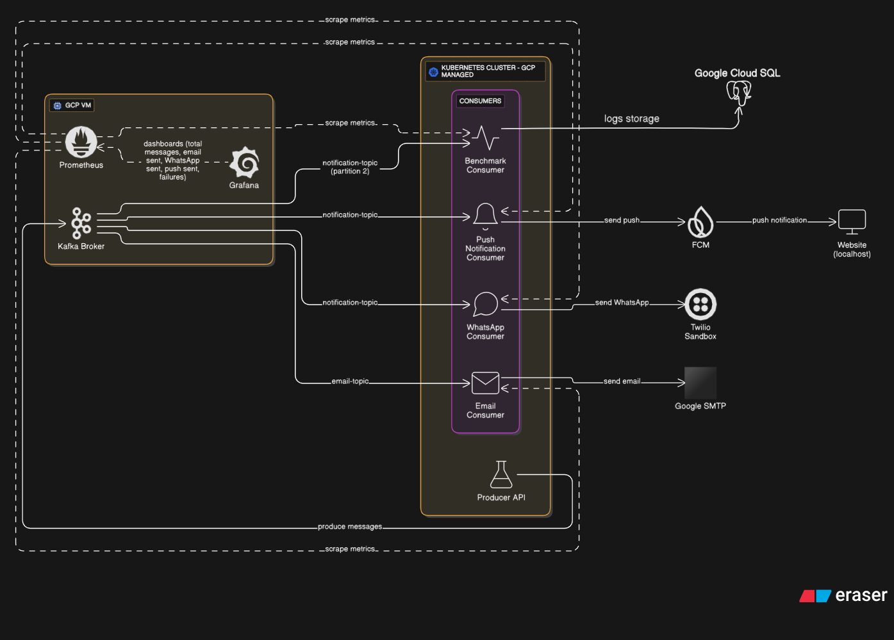
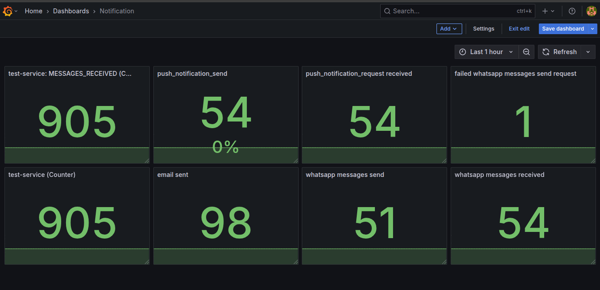
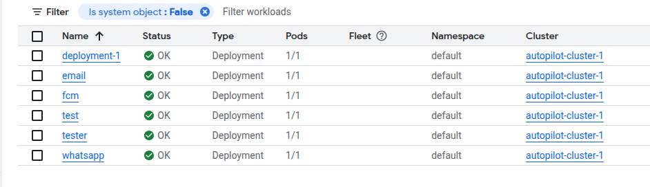
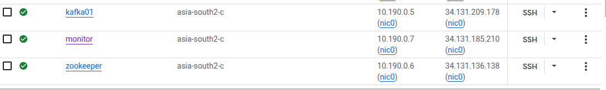

# 📣 Kafka-Based Notification System

A scalable microservice system using **Apache Kafka** for **email**, **WhatsApp**, and **push notifications**. Deployed on **Kubernetes** with **Prometheus/Grafana** monitoring.

## 🏗️ Architecture



```
Producer API (K8s) → Kafka (GCP VM) → Consumers (K8s)
                                    ├── Email
                                    ├── WhatsApp (Twilio)
                                    └── Push (FCM)
```

## ⚙️ Tech Stack

- **Kafka** (GCP VM), **Kubernetes**, **Flask**
- **FCM** (Push), **Twilio** (WhatsApp), **SMTP** (Email)
- **Prometheus + Grafana** (Monitoring)

## � Quick Start

### Kafka Topics
```bash
bin/kafka-topics.sh --create --topic email-topic --bootstrap-server localhost:9092 --partitions 2
bin/kafka-topics.sh --create --topic notification-topic --bootstrap-server localhost:9092 --partitions 2
```

### Deploy
```bash
kubectl apply -f k8s/
```

### Send Message
```bash
curl -X POST "http://<producer-service>:5000/send-kafka" \
  -H "Content-Type: application/json" \
  -d '{"no": 1, "type": "order", "content": "Order confirmed!", "topic": "notification-topic"}'
```

## � Screenshots

| Service | Screenshot |
|---------|------------|
| Grafana Dashboard |  |
| WhatsApp Messages |  |
| FCM Push Notifications |  |
| Kubernetes Dashboard |  |
| VM Monitoring |  |

## 📁 Structure

```
├── assets/          # Screenshots
├── email/           # Email consumer
├── fmc/             # FCM push service
├── whatsapp/        # WhatsApp consumer
├── webapp/          # Push notification demo
├── producer.py      # Kafka producer
└── backendapi.py    # Registration API
```

## � Notes

- Kafka secured within VPC
- FCM requires HTTPS for production
- Twilio sandbox for WhatsApp testing
- Metrics exported to Prometheus

---

**License:** MIT © 2025 nXtCyberNet

