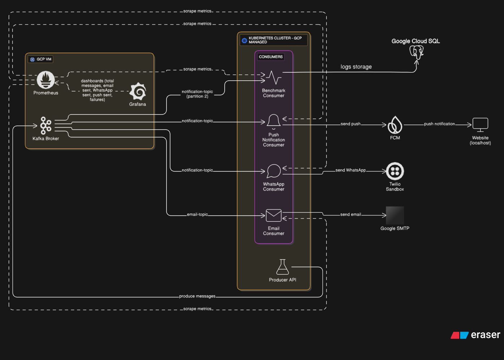
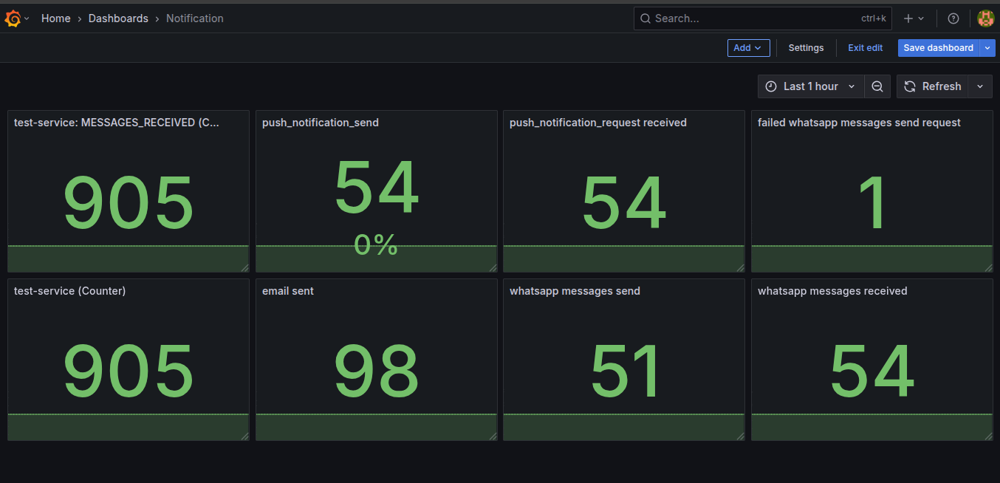

# 📣 Kafka-Based Notification System

A scalable, event-driven microservice system using **Apache Kafka**, built to send **email**, **WhatsApp**, and **push notifications**. Consumers and producers are deployed in **Kubernetes**, monitored with **Prometheus** and **Grafana**.

---

## 🏗️ System Architecture


*Complete system architecture showing Kafka, Kubernetes, and GCP infrastructure*

```
[Producer API] (K8s Pod)
     ↓
[Kafka Broker] (GCP VM)
     ↓
├── email-topic (2 partitions) ─▶ Email Consumer (K8s)
├── notification-topic (2 partitions)
│   ├─▶ WhatsApp & FCM Consumer (K8s)
│   ├─▶ Push Notification logic (K8s)
│   └─▶ Benchmark/Log Consumer (K8s)
     
[Website] (localhost) ◀─── Push notification from FCM
[WhatsApp Business API] ◀─── WhatsApp messages from consumer
     
[Prometheus + Grafana] (GCP VM) ◀─── Metrics from consumers
```

## ⚙️ Tech Stack

* **Kafka** – Deployed on GCP VM
* **Kubernetes** – All consumers and producer API deployed here
* **Flask** – Producer API
* **Confluent Kafka (Python client)**
* **FCM** – Push notifications (tested on local site via HTTP)
* **WhatsApp Business API** – WhatsApp message delivery
* **Email/WhatsApp APIs** – google SMTP 
* **Prometheus + Grafana** – Metrics and dashboard, deployed in GCP VM

---

## 🔧 Setup Guide

### 📦 Kafka Setup (on GCP VM)

Ensure Kafka is running and has the following topics:

```bash
# Create topics if not already created
bin/kafka-topics.sh --create --topic email-topic --bootstrap-server localhost:9092 --partitions 2 --replication-factor 1
bin/kafka-topics.sh --create --topic notification-topic --bootstrap-server localhost:9092 --partitions 2 --replication-factor 1
```

### 🚀 Deploy to Kubernetes

All services are containerized and deployed to Kubernetes using standard `Deployment` and `Service` manifests.

```bash
kubectl apply -f k8s/email-consumer.yaml
kubectl apply -f k8s/whatsapp-consumer.yaml
kubectl apply -f k8s/push-consumer.yaml
kubectl apply -f k8s/benchmark-consumer.yaml
kubectl apply -f k8s/producer-api.yaml
```

> Ensure all pods can reach the Kafka broker (use internal IP or VPC IP of VM).

---

## 📤 Producer API (Flask)

### Run inside cluster (or local port-forward)

Send Kafka messages:

```bash
curl -X POST "http://<producer-service>:5000/send-kafka" \
  -H "Content-Type: application/json" \
  -d '{
    "no": 1,
    "type": "order",
    "content": "Your order is confirmed!",
    "topic": "notification-topic",
    "partition": 1
  }'
```

---

## 📬 Consumers Behavior

* **Email Consumer**:

  * Reads from `email-topic` (both partitions)
  * Filters messages by type (`promotion`, `order`)
  * Sends emails accordingly

* **WhatsApp + Push Notification Consumer**:

  * Reads from `notification-topic`
  * Sends WhatsApp and FCM-based push notifications

* **Benchmark Consumer**:

  * Only listens to `notification-topic` → Partition 1
  * Tracks throughput, errors, logs system health
  * Sends custom metrics to Prometheus

---

## 📊 Monitoring: Prometheus + Grafana (on VM)

**Prometheus** scrapes `/metrics` from each consumer API via NodePort or ClusterIP + VPC routing.

**Grafana Dashboard Includes:**

* Total messages received
* Messages by type: Email / WhatsApp / Push
* Failed messages
* Partition-wise message count
* Latency (if benchmarked)
* Per-service counters

### 📈 Grafana Dashboard Screenshots


*Main dashboard showing services metrises*

## 💬 WhatsApp Notifications

use twillio sandbox for now 

### 📱 WhatsApp Message Screenshots


*Order confirmation message sent via WhatsApp*

---

## 🔔 Push Notifications (Localhost Website)

* Website runs on **localhost** due to `http://` restrictions.
* FCM requires HTTPS for production; testing is done via local service worker.
* The push consumer sends notifications to FCM, and the browser receives it using registered token.

### 📱 Push Notification Screenshots


*Browser notification permission request*


*Example of received push notification on desktop*


*Push notification display on mobile browser*

---

## ☁️ GCP Infrastructure

### 🎛️ GCP Kubernetes Engine Dashboard


*Kubernetes cluster overview showing all deployed services*


*Deployed workloads including consumers and producer API*


*Kubernetes services and networking configuration*


*Pod status and resource utilization*

### 🖥️ GCP VM Dashboard


*Kafka broker VM instance details and configuration*


*VM resource monitoring including CPU, memory, and network*


*System logs and Kafka broker logs*


*Network security and firewall configuration*

---

## 📁 Folder Structure

```
.
├── k8s/                    # Kubernetes manifests
│   ├── email-consumer.yaml
│   ├── whatsapp-consumer.yaml
│   ├── push-consumer.yaml
│   ├── benchmark-consumer.yaml
│   └── producer-api.yaml
├── consumers/
│   └── *.py                # Consumer logic
├── producer_api.py         # Kafka producer API (Flask)
├── dashboard/
│   └── grafana_dashboard.json
├── metrics/
│   └── prometheus_metrics.py
├── website/                # Push notification demo
│   └── index.html, sw.js
├── screenshots/            # System screenshots and diagrams
│   ├── system-architecture-diagram.png
│   ├── architecture-components.png
│   ├── data-flow-diagram.png
│   ├── infrastructure-layout.png
│   ├── grafana-dashboard-overview.png
│   ├── grafana-metrics-details.png
│   ├── grafana-alerts.png
│   ├── whatsapp-business-api-setup.png
│   ├── whatsapp-order-confirmation.png
│   ├── whatsapp-promotion-message.png
│   ├── whatsapp-system-alert.png
│   ├── whatsapp-message-status.png
│   ├── whatsapp-template-messages.png
│   ├── push-notification-permission.png
│   ├── push-notification-received.png
│   ├── push-notification-mobile.png
│   ├── gke-cluster-overview.png
│   ├── gke-workloads.png
│   ├── gke-services.png
│   ├── gke-pods-status.png
│   ├── vm-instance-overview.png
│   ├── vm-monitoring.png
│   ├── vm-logs.png
│   └── vm-firewall-rules.png
├── requirements.txt
└── README.md
```

---

## 📌 Notes

* Kafka exposed only within VPC for security.
* Consumers send metrics via `prometheus_client`:

```python
from prometheus_client import Counter

EMAILS_SENT = Counter("emails_sent_total", "Number of emails sent")
WHATSAPP_SENT = Counter("whatsapp_sent_total", "Number of WhatsApp messages sent")
PUSH_SENT = Counter("push_notifications_sent_total", "Number of push notifications sent")
```

* Localhost push notification is for development only.
* WhatsApp Business API requires approved message templates for production use.

---

## 📸 Screenshot Guidelines

To capture and add screenshots to this project:

1. **Create a `screenshots/` directory** in your project root
2. **Capture screenshots** of:
   - **Architecture diagrams** (create using draw.io, Lucidchart, or similar tools)
   - Grafana dashboard with live metrics
   - WhatsApp Business API console and sent messages
   - Push notifications in browser
   - GCP Kubernetes Engine console
   - GCP VM instance details
3. **Optimize images** (compress to reduce file size)
4. **Use descriptive filenames** as shown in the folder structure
5. **For architecture diagrams**:
   - Use consistent colors and styling
   - Include all major components (Kafka, K8s, GCP VM, external APIs)
   - Show data flow direction with arrows
   - Label all connections and ports
6. **For WhatsApp screenshots**:
   - Include both sender and receiver views
   - Show message delivery status
   - Capture different message types (order, promotion, alert)

---

## 🔮 Future Enhancements

* Expose website securely with HTTPS + SSL termination
* Add Dead Letter Queue (DLQ) support for failed messages
* Retry logic and idempotent message handling
* Auto-scaling consumers using HPA
* Add Jaeger/OpenTelemetry for tracing
* Implement real-time dashboard updates
* Add mobile app for push notification testing
* WhatsApp chatbot integration for two-way communication
* Multi-language WhatsApp template support
* Rich media support for WhatsApp (images, documents)
* Interactive architecture diagram with clickable components

---

## 🤝 Contributions

Pull requests and issues are welcome! Please fork and open a PR.

When contributing screenshots:
- Ensure no sensitive information is visible (phone numbers, API keys, personal data)
- Use consistent image formats (PNG recommended)
- Add descriptive alt text for accessibility
- For WhatsApp screenshots, blur or redact personal information
- For architecture diagrams, maintain the existing design style

---

## 📝 License

MIT License © 2025 nXtCyberNet

*Last updated: 2025-07-01 14:27:32 UTC*
